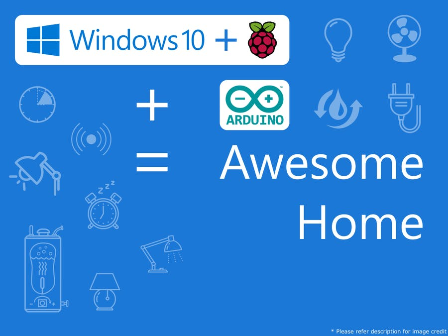

# Home-Automation--RPi2-WinIoT-

In today's era, technology can enhance human life. Technology is evolving decade by decade. Automation was a science fiction earlier but not today. By combining latest technology with home, we can build an awesome home. With the Raspberry Pi and Windows 10, we can build a home automation system that is capable of operating home devices automatically.

This project got awarded title "World's Best Project" in a [Microsoft Challange](https://www.hackster.io/contests/Windows10Automation#category-52)

Learn how to build Home Automation with Raspberry Pi and Arduino @
https://www.hackster.io/AnuragVasanwala/home-automation-using-raspberry-pi-2-and-windows-10-iot-0dcefc
